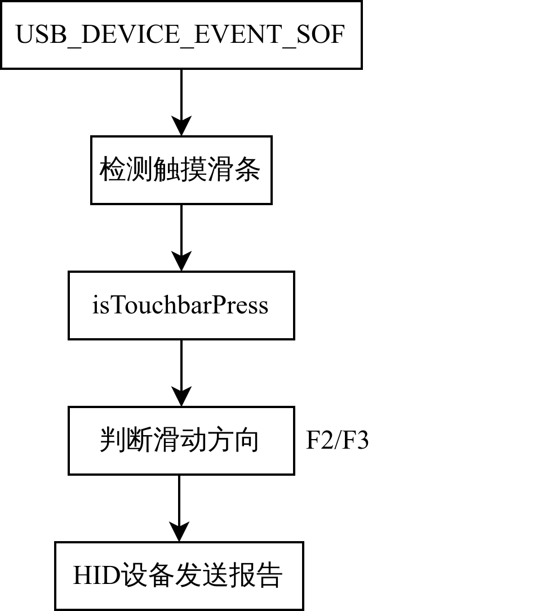

# SAMD21 Touchbar USB HID

基于 Microchip 的 SAMD21 Curiosity Nano 核心板及 Curiosity Nano EVB 扩展板，通过 USB HID 协议实现了一个键盘设备，通过使用 Touch 库实现了对触摸滑条左右滑动的识别，将不同方向滑动作为两个按键（F2、F3）按下，上报至 PC，从而实现 PC 音量调节。

# 📦 Prerequisites

开发环境：MPLAB X IDE

1. 编译器：[xc32 v4.35](https://www.microchip.com/en-us/tools-resources/develop/mplab-xc-compilers/xc32)
2. Packs: SAMD21_DFP 3.6.144、CMSIS 5.8.0、PKOB nano 1.13.715
3. MCC Content Libraries：
   1. MCC Harmony Core 1.5.1
   2. csp v3.18.2
   3. core v3.13.3
   4. bsp v3.17.0
   5. CMSIS_5 5.9.0
   6. 触摸设备库：touch v3.15.0、touch_apps v3.6.0、touch_host_driver v1.0.0
   7. USB库：usb v3.12.0、usb_apps_device v3.6.0

上述所列的部分库是必需的。

# 📜 Documentation

## ⛓️ Workflow

    

## 📽️ More details

1. 项目详细说明，[CSDN：基于SAMD21G17D的触摸滑条USB HID设备实现及控制PC音量的功能开发(USB HID+MPLAB)](https://blog.csdn.net/weixin_46422143/article/details/136637400)
2. 项目功能演示，[B站：基于SAMD21G17D的触摸滑条USB HID设备实现及控制PC音量的功能开发](https://www.bilibili.com/video/BV1dr421H7yP/)
